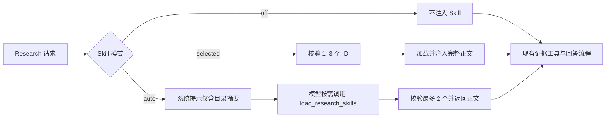

# 精选科研方法 Skills P1 设计

日期：2026-07-19

## 目标

为 Research Agent 增加 10 个经过审阅、只读、说明性的科研方法 Skill。Skill 提供分析流程、检查清单和输出结构，不作为事实证据，也不扩大 Research Agent 原有的数据、网络或写入权限。

首批范围：

1. 文献检索与 DOI 核验
2. 证据分级与论文批判
3. 假设生成与竞争性假设
4. DOE 与统计分析计划
5. 化学身份与性质核验
6. 配方相容性风险矩阵
7. 高温高压与盐水验证设计
8. 放大风险与验证 Gate
9. 科研报告结构化写作
10. 油井水泥外加剂异常诊断

## 产品能力

Skill 把“如何研究”从系统提示词中的通用原则提升为可选择、可版本化、可审阅的方法资产：

- 用户可让 Agent 自动选择与问题匹配的方法，也可显式选择最多 3 个方法。
- Agent 只在需要时加载正文；常驻上下文仅暴露 ID、分类和短描述。
- 最终回答区分方法指导与事实证据，并列出本轮使用的方法及版本。
- 油田化学场景获得配方相容性、HTHP/盐水验证、放大 Gate 和油井水泥异常诊断等专用方法。

## 唤起方式

Research 模式新增三种会话内选择状态：

- `auto`：默认值。模型根据用户问题和短描述按需加载，单轮最多 2 个 Skill。
- `off`：本轮不加载任何 Skill。
- `selected`：用户显式选择 1–3 个 Skill；服务端在本轮系统上下文中预加载正文。

自然语言点名 Skill 名称或描述属于 `auto` 的模型选择信号，不绕过数量和权限限制。显式选择只对当前请求生效；请求完成后恢复 `auto`。

## 内容和注册表

每个 Skill 目录只包含：

- `manifest.json`：固定 ID、名称、版本、分类、短描述、来源、许可证、审阅状态、允许工具和正文 SHA-256。
- `SKILL.md`：说明性方法正文。

注册表启动时或首次访问时执行校验：

- ID、版本、目录名、重复项和必填元数据合法；
- `review_status` 必须为 `approved`；
- 许可证为 `MIT`，来源标记为项目自编；
- 目录不得包含脚本、依赖声明或清单之外的文件；
- 正文不超过 8,000 字符，且 SHA-256 与清单一致；
- `allowed_tools` 只能引用 Research Agent 已知工具；
- 拦截权限提升、强制调用、忽略系统指令、安装依赖、执行 shell、费用操作、读取凭据和写入/删除笔记本或来源等语句。

正文只在显式选择或 `load_research_skills` 工具成功调用后进入模型上下文。目录接口不返回正文。

## 权限模型

Skill 是方法说明，不是可执行插件：

- 不携带或执行脚本；
- 不安装依赖；
- 不修改笔记本、来源或任何业务数据；
- 不读取本地文件、环境变量、凭据或密钥；
- 不自动发起付费操作；
- 不授权 Web、科研数据库或跨笔记本能力。

`allowed_tools` 是收窄提示，不是授权。实际可用工具仍由请求中的 Web、科研数据库和跨笔记本开关决定；两者取交集。

## 后端流程

API 增加只读目录端点，并在 Research 执行请求中增加：

- `research_skill_mode`: `auto | off | selected`
- `research_skill_ids`: Skill ID 数组

服务端拒绝未知 ID、重复 ID、数量越界以及模式与 ID 不一致的请求。

## 前端交互

Research 输入区新增“科研方法”下拉菜单：

- 可选择“自动”或“关闭”；
- 可勾选最多 3 个具体方法；
- 显示当前模式或已选数量；
- 流式生成期间禁用修改；
- 所有可见文案使用 i18n；
- 目录通过相对 `/api` 获取。

自动加载时 SSE 活动流显示“正在加载科研方法”。显式选择的名称在选择器中可见，最终回答按提示列出方法名称与版本。

## 回答和证据约束

- Skill 内容只指导检索、比较、实验设计、统计和写作结构。
- Skill 不能作为结论引用，不能生成 `[source:*]` 或 `[external:*]` 证据 ID。
- 最终答案仅引用真实工具返回的本地或外部证据。
- 使用 Skill 时增加“本轮科研方法”小节，列出 ID、版本及其用途。
- 无证据时必须说明证据缺口；方法清单不能替代实验结果或文献结论。

## 非目标

- 导入 OpenScience 的 290+ Skills；
- 运行第三方 Skill 脚本或自动安装依赖；
- Skill 市场、用户上传、在线更新或后台编辑器；
- 为 Quick Chat、Source Chat 或 Ask 开放 Skills；
- 修改部署拓扑或新增生产依赖。

## 验收标准

- 注册表只发布 10 个已批准 Skill，所有内容通过哈希、长度、文件和危险语句校验。
- `auto` 最多加载 2 个，`selected` 接受 1–3 个，`off` 不加载。
- Skill 不能扩大 Web、数据库、跨笔记本和写入权限。
- UI 能完成自动、关闭和显式选择，发送正确请求并显示加载活动。
- 中英文及其余现有 locale 均有可见文案键。
- 后端、前端目标测试和默认非 E2E 回归通过。
